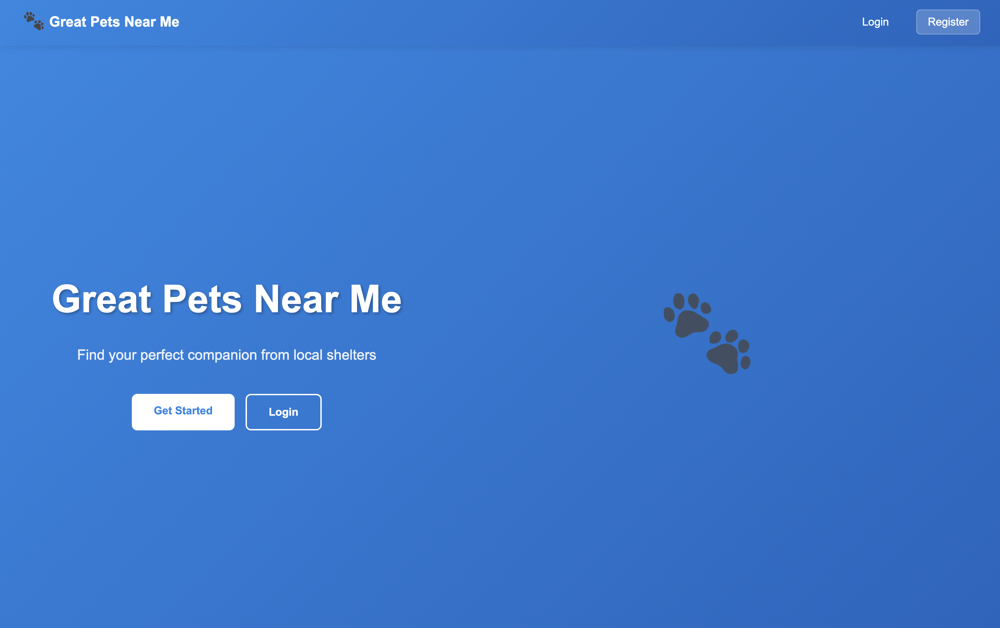
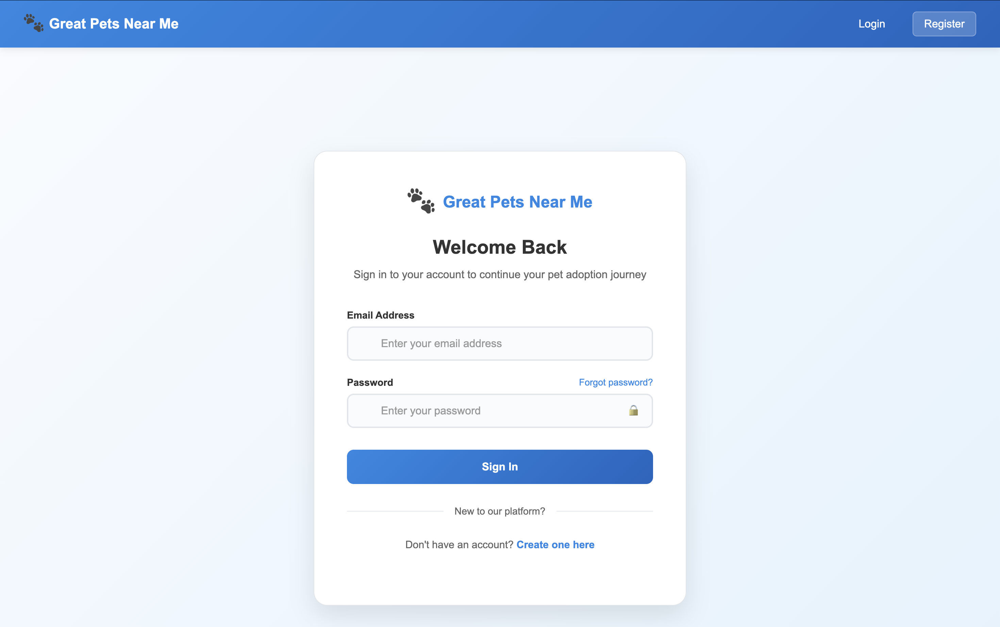
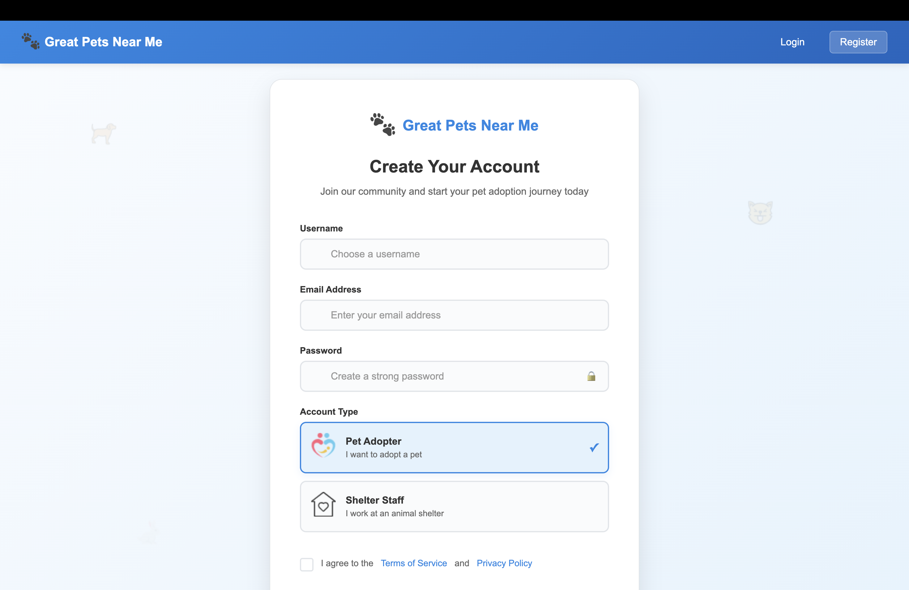
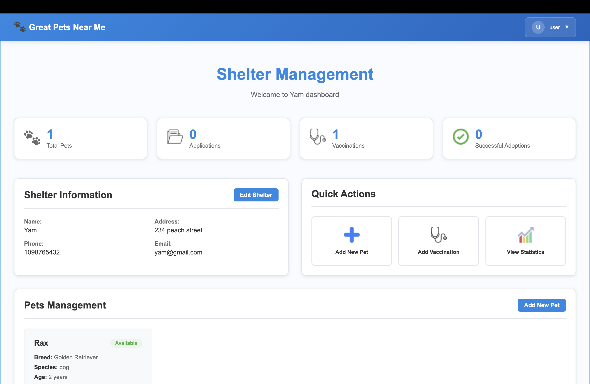

# 🐾 Great Pets Near Me

A full-stack pet adoption platform where users can browse, adopt pets, and manage adoption records from local shelters.

---

## 🚀 Live Demo
🔗 https://unique-quokka-15e059.netlify.app  
🔗 Backend: https://great-pets-near-me.onrender.com

---

## 📌 Features

- 👤 User Authentication (Register / Login)
- 🐶 Browse Available Pets
- 🏠 Shelter Management
- 📋 Adoption Records
- 💉 Vaccination Tracking
- 📊 Dashboard & Stats
- 🔐 Secure API with JWT

---

## 🛠️ Tech Stack

### Frontend
- Angular
- TypeScript
- CSS

### Backend
- Node.js
- Express.js
- MongoDB (Mongoose)

### Deployment
- Frontend: Netlify
- Backend: Render
- Database: MongoDB Atlas

---

## 📸 Screenshots

### 🏠 Home Page


---

### 🔐 Login Page
<!-- Add screenshot later -->


---

### 📝 Register Page
<!-- Add screenshot later -->


---

### 🐾 Pets Listing
<!-- Add screenshot later -->


---

### 📊 Dashboard / Stats
<!-- Add screenshot later -->


---

## ⚙️ How to Run Locally

### 1️⃣ Clone the repository
```bash
git clone https://github.com/Yamini28-alpha/great-pets-near-me.git
cd great-pets-near-me
